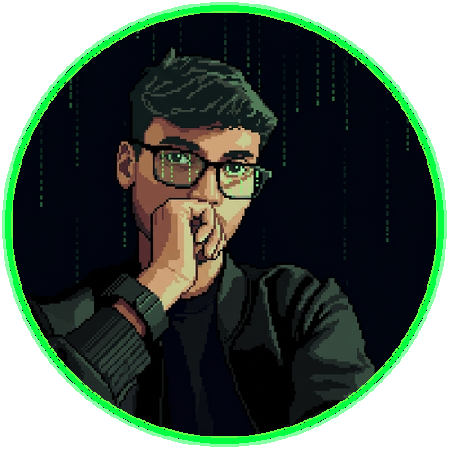

<!-- ═══════════════════════ MATRIX CYBER HUD BANNER ═══════════════════════ -->
<div align="center">
  
</div>

<br/>

<!-- ═══════════════════════ 32-BIT PIXEL ART AVATAR ═══════════════════════ -->
<div align="center">
  <a href="https://github.com/ctrlaltsolveorg-cloud">
    
  </a>
  <br/><br/>
  <samp style="color: #00ff41; font-weight: bold; letter-spacing: 1px;">
    &lt; 01001000 01000001 01000011 01001011 // OPERATIVE: PIYUSH KUMAR &gt;
  </samp>
</div>

<br/>

<!-- ═══════════════════════ MATRIX TERMINAL TYPING LOOP ═══════════════════════ -->
<div align="center">
  <a href="https://github.com/ctrlaltsolveorg-cloud">
    
  </a>
</div>

<p align="center">
  <a href="https://horizon-home-tuition.vercel.app">
    
  </a>
  <a href="mailto:piyushkumarsihari@gmail.com">
    
  </a>
  
  
</p>

<br/>

<!-- ═══════════════════════ OPERATIVE IDENTITY MANIFEST ═══════════════════════ -->
```bash
⚡ operative@matrix-terminal:~$ ./identity_manifest.sh
─────────────────────────────────────────────────────────────────────────────
[+] OPERATIVE       : Piyush Kumar (@ctrlaltsolveorg-cloud)
[+] CLASSIFICATION  : Full-Stack Systems Architect & AI Systems Engineer
[+] CIPHER STACK    : Next.js 15 · TypeScript · Supabase · Postgres · Docker
[+] FLAGSHIP CORE   : HORIZON (Enterprise Tuition Management & Scheduling Engine)
[+] DIRECTIVE       : "Break architectural bottlenecks. Zero latency. Ship immutable code."
─────────────────────────────────────────────────────────────────────────────
[STATUS] 200 OK • ALL CIPHERS COMPILED • SYSTEMS OPERATIONAL
```

<br/>

<!-- ═══════════════════════ TARGET SYSTEMS & MISSIONS ═══════════════════════ -->
<h3 align="center" style="color: #00ff41;">⚡ [MISSION TARGETS &amp; LIVE DEPLOYMENTS] ⚡</h3>

| Target Code | System Architecture | Protocol &amp; Impact |
| :--- | :--- | :--- |
| **[HORIZON](https://horizon-home-tuition.vercel.app)** | Next.js 15, TypeScript, Supabase, Postgres | Complete enterprise-grade tuition orchestration engine. Multi-duty RBAC admin allocation, verified tutor pipeline, and encrypted auth with real-time sync. |
| **NEURAL AUTOMATION** | Python, LangChain, Next.js, LLM Agents | Autonomous coding agents, automated customer triage, dynamic schema migrations, and high-precision scrapers. |

<br/>

<!-- ═══════════════════════ TECH STACK MATRIX ═══════════════════════ -->
<h3 align="center" style="color: #00ff41;">💻 [CYBER ARSENAL &amp; CIPHER MATRIX] 💻</h3>

<div align="center">
  
  <br/>
  
</div>

<br/>

<!-- ═══════════════════════ MATRIX STATS & METRICS ═══════════════════════ -->
<h3 align="center" style="color: #00ff41;">📊 [INTRUSION METRICS &amp; PROOF OF EXECUTION] 📊</h3>

<div align="center">
  
  
</div>

<br/>

<div align="center">
  
</div>

<br/>

<!-- ═══════════════════════ MATRIX ACTIVITY GRAPH ═══════════════════════ -->
<div align="center">
  
</div>

<br/>

<!-- ═══════════════════════ AUTONOMOUS CONTRIBUTION SNAKE ═══════════════════════ -->
<div align="center">
  <p><samp>🐍 <b>NEURAL CONTRIBUTION PATHFINDER // MATRIX SNAKE PROTOCOL</b> 🐍</samp></p>
  <p><samp style="color: #39ff14;">[AUTONOMOUS SNAKE: CONSUMES CONTRIBUTIONS &bull; CONTINUOUS GROWTH &bull; ZERO COLLISION]</samp></p>
  <picture>
    <source media="(prefers-color-scheme: dark)" srcset="https://raw.githubusercontent.com/ctrlaltsolveorg-cloud/ctrlaltsolveorg-cloud/output/github-snake-dark.svg" />
    <source media="(prefers-color-scheme: light)" srcset="https://raw.githubusercontent.com/ctrlaltsolveorg-cloud/ctrlaltsolveorg-cloud/output/github-snake.svg" />
    
  </picture>
</div>

<br/>

<!-- ═══════════════════════ MATRIX FOOTER ═══════════════════════ -->
<div align="center">
  <samp style="color: #00ff41; background: #0d1117; padding: 6px 16px; border: 1px solid #00ff41; border-radius: 4px; font-weight: bold;">
    01010011 01011001 01010011 01010100 01000101 01001101 &bull; 01001111 01010110 01000101 01010010 01010010 01001001 01000100 01000101
  </samp>
  <br/><br/>
  <em style="color: #4ade80; font-family: monospace;">&ldquo;There is a difference between knowing the path and walking the path.&rdquo; &mdash; Morpheus</em>
  <br/><br/>
  
</div>


