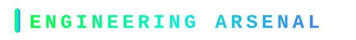

<!-- ═══════════════════════ BANNER ═══════════════════════ -->

<!-- ═══════════════════════ TYPING INTRO ═══════════════════════ -->

  

  
  
  
  

 

<!-- ═══════════════════════ THE SHORT VERSION ═══════════════════════ -->

  
  &nbsp;&nbsp;
  

 

<!-- ═══════════════════════ WHAT I'M BUILDING ═══════════════════════ -->

 

| Project | Stack | What it is |
| :------ | :---- | :--------- |
| **[HORIZON](https://horizon-home-tuition.vercel.app)** | Next.js 15, TypeScript, Supabase, Postgres | Complete enterprise-grade tuition orchestration engine. Multi-duty RBAC admin allocation, verified tutor pipeline, and encrypted auth with real-time sync. |
| **Autonomous AI Agents** | Python, LangChain, Claude / OpenAI API | Self-operating agent loops, automated customer triage, dynamic schema migrations, and high-precision scrapers. |
| **High-Throughput Micro-Engines** | Node.js, Express, Docker, Redis | Low-latency REST & WebSocket gateways, event-driven background queues, and secure payment integrations. |

 

<!-- ═══════════════════════ ENGINEERING ARSENAL ═══════════════════════ -->

 

 

  

 

<!-- ═══════════════════════ PROOF OF WORK ═══════════════════════ -->

  
  

  

 

  

 

  <picture>
    <source media="(prefers-color-scheme: dark)" srcset="https://raw.githubusercontent.com/ctrlaltsolveorg-cloud/ctrlaltsolveorg-cloud/output/github-snake-dark.svg" />
    <source media="(prefers-color-scheme: light)" srcset="https://raw.githubusercontent.com/ctrlaltsolveorg-cloud/ctrlaltsolveorg-cloud/output/github-snake.svg" />
    
  </picture>

 

<!-- ═══════════════════════ BEYOND THE CODE ═══════════════════════ -->

 

I don't just write code &mdash; I build end-to-end architectures and ship systems that solve real friction. From engineering the flagship **HORIZON** tuition platform to architecting autonomous agent loops, everything is built for scale, speed, and continuous iteration.

 

<!-- ═══════════════════════ FOOTER ═══════════════════════ -->

 

<em>&ldquo;Discipline, speed, and continuous iteration create compounding excellence.&rdquo;</em>

  

